# Timely :: 그룹 스케줄 관리 및 지각 방지

## 프로젝트 소개

**나 곧 도착해 (사실 이제 출발함)** 상황을 경험하신 적 있나요? 곧 만나는 친구가 어디에서 기다리고 있는지, 어디쯤 왔는지 궁금하신가요? 

Timely를 통해 일정을 관리하고 위치를 확인하세요!

### 프로젝트 주요 기능

- 그룹원들과 일정을 공유할 수 있어요.
- 일정 참석 여부를 표현할 수 있어요.
- 그룹원들과 일정 시작 30분 전 위치를 공유할 수 있어요.
- 그룹원들과 게시글을 통해 사진을 공유할 수 있어요.
- 사용자의 참석/지각 카운터 측정

## 프로젝트 구성

### 팀원

|이름|담당|Github|
|---|---|---|
|유종환|Backend|https://github.com/Potato-Y|
|이동수|Client, 기획|https://github.com/dongsu0717|

### 개발 기간

2024.10 ~ 2024.12 (약 2개월) 
이후의 작업은 기존 코드 개선 및 새로운 기술 스택 학습용으로 이루어집니다.

### 프로젝트 기술 스택

      

- Spring Boot 버전: 3.3.x
- 그 외, JPA, AWS CloudFront

## 프로젝트 아키텍처

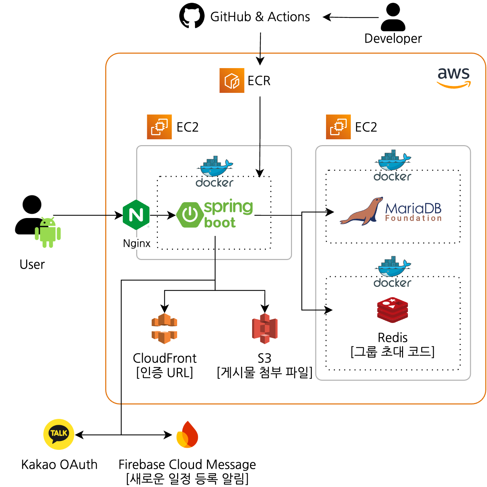

## 프로젝트 미리보기

### 개인 스케줄 관리
<table>
  <tr><th>캘린더</th><th>개인 스케줄 추가</th><th>권한 확인(위치, 알람)</th></tr>
  <tr>
    <td>
      
    </td>
    <td>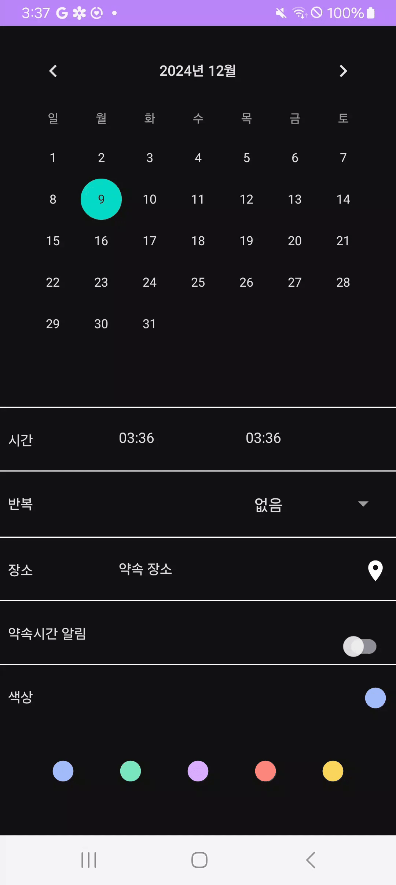</td>
    <td>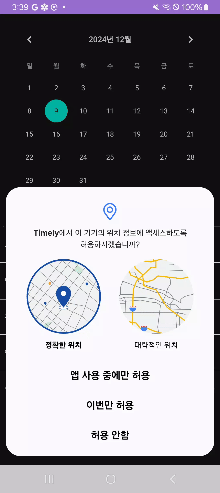</td>
  </tr>
</table>
 

<table>
  <tr><th>약속 위치 검색</th><th>약속장소 경로안내</th></tr>
  <tr>
    <td>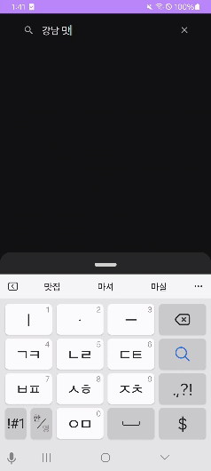</td>
    <td></td>
  </tr>
</table>
 

<table>
  <tr><th>알람 - 장소X(데이터X)</th></tr>
  <tr>
    <td></td>
  </tr>
  <tr><th>알람 - 장소O(시간, 거리 표시)</th></tr>
  <tr>
    <td></td>
  </tr>
</table>
 

### 그룹 스케줄 관리
<table>
  <tr><th>KaKao 로그인</th><th>그룹 생성</th><th>내 그룹 리스트</th></tr>
  <tr>
    <td>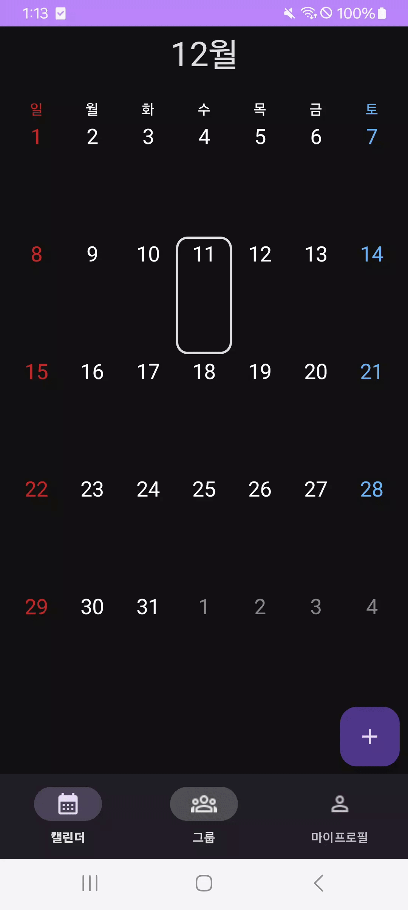</td>
    <td>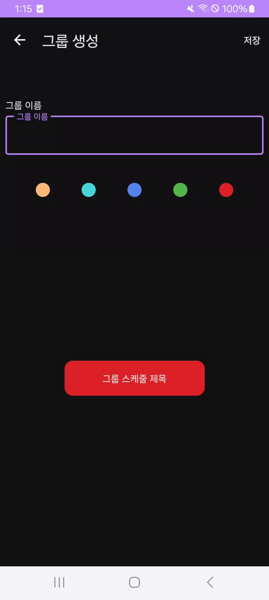</td>
    <td>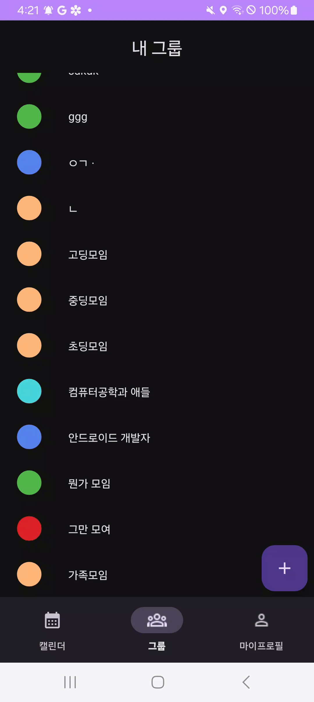</td>
  </tr>
</table>
 

<table>
  <tr><th>그룹 페이지</th><th>그룹 초대</th><th>그룹 스케줄 생성</th></tr>
  <tr>
    <td>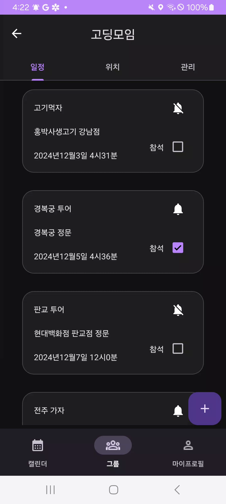</td>
    <td>
      
    </td>
    <td>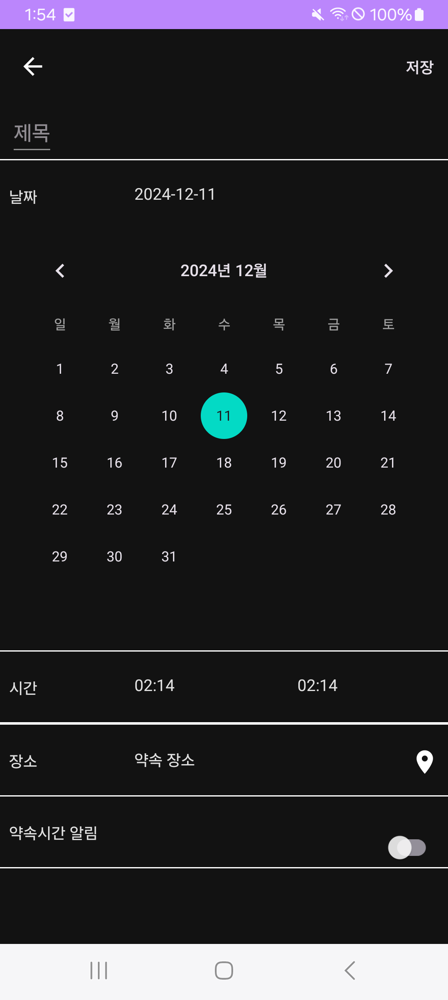</td>
  </tr>
</table>
 

<table>
  <tr><th>스케줄 생성 알람</th><tr>
  <tr>
    <td></td>
  </tr>
  <tr><th>모임 1시간전 알람</th><tr>
  <tr>
    <td></td>
  </tr>
  <tr><th>위치 공유 시작 알람</th><tr>
  <tr>
    <td>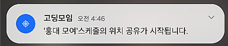</td>
  </tr>
</table>
 

<table>
  <tr><th>그룹원 위치, 상태 확인</th><th>지각 체크후 지도 종료</th></tr>
  <tr>
    <td>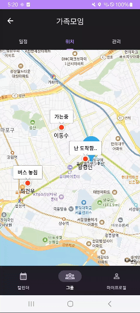</td>
    <td></td>
  </tr>
</table>
 